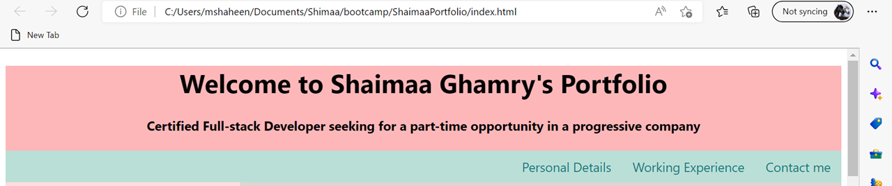
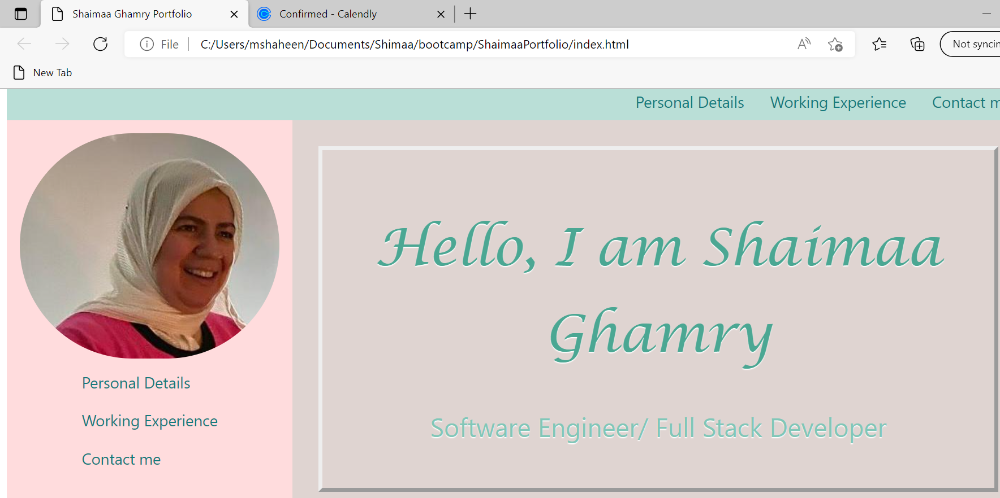
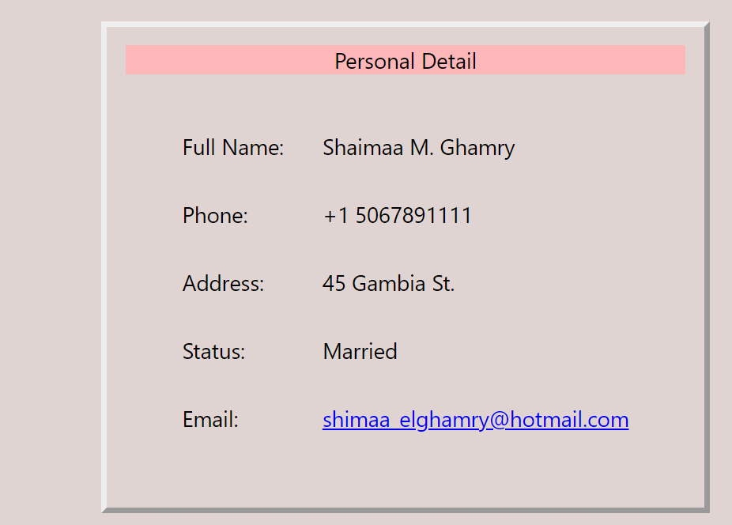
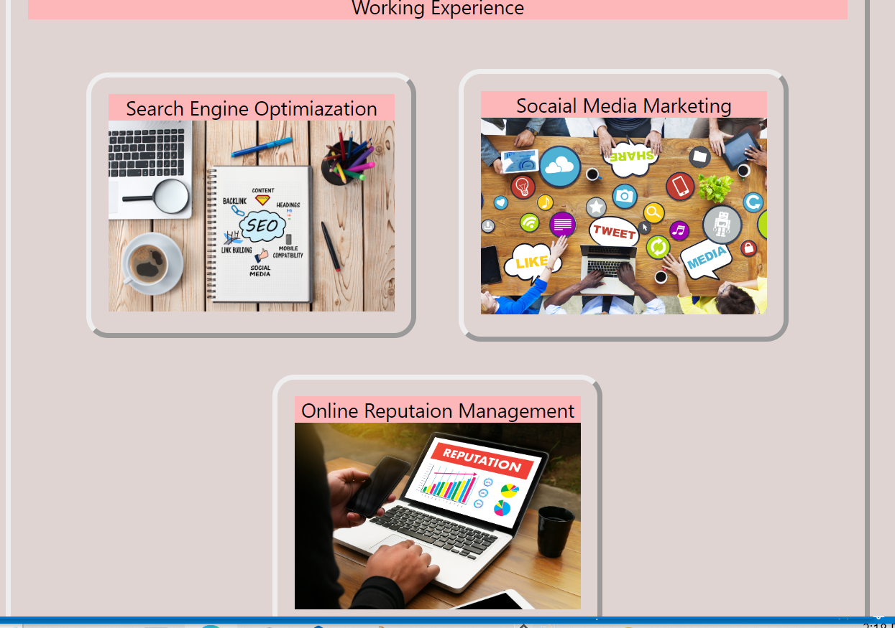
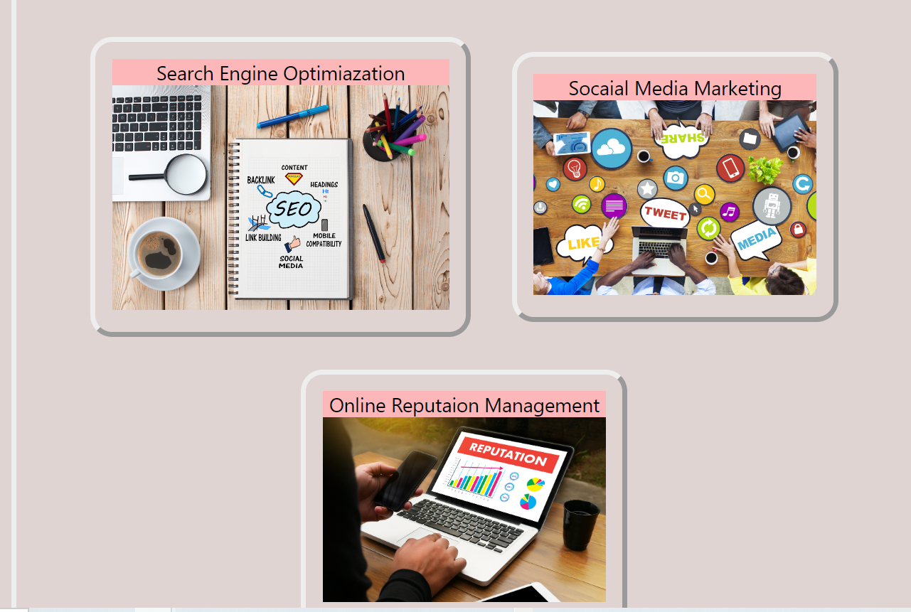

# ShaimaaPortfolio

# The deployed URL:
https://shaimaaghamry.github.io/ShaimaaPortfolio/

## Description
In this challenge you ll find my portfolio in which i mentioned my objective of this portfolio,

 ## then there is a section presenting my personal photo and welcoming statement

 

 ##then there are navigation links to enable you to view my personal details, my working experience and to contact me

## then there is section presenting my working experience applications

## There is a navigation bar in the header , aside, and the footer of the page

when you click on one of the navigation link it will scroll down to the section to which it refers

when you click on the contactme link it enables the user to send email to my inbox

## In the working experience section, many applications are presented and when u passed the mouse upon one of them it will enlarge in size
 
